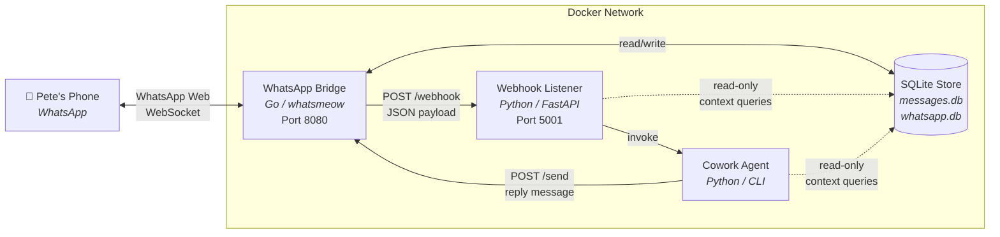
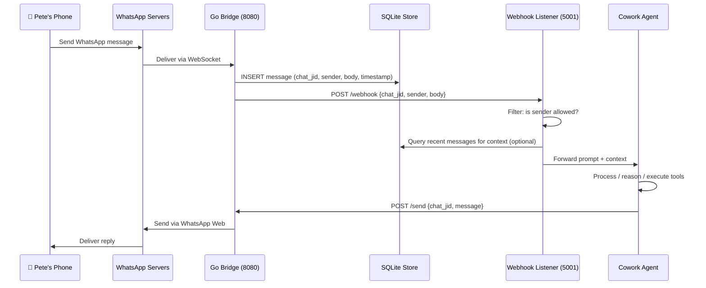

# WhatsApp ↔ Cowork Personal Assistant Integration

## Architecture Overview

This document describes the architecture for a local, self-hosted integration that allows Pete to interact with his Cowork personal assistant via WhatsApp. The system is event-driven: incoming WhatsApp messages trigger Cowork actions in real time, and responses are sent back through WhatsApp.

The design is deliberately simple and avoids MCP. All components run locally on a single machine (with optional Docker containerisation) and no cloud services are required.

Based on [github.com/lharries/whatsapp-mcp](https://github.com/lharries/whatsapp-mcp) — we reuse the Go bridge and replace the MCP server with a webhook-driven Python stack.

---

## Design Principles

- **Fully local**: all data stays on-machine, no external APIs beyond WhatsApp Web
- **Event-driven**: incoming messages trigger actions immediately via HTTP webhook
- **Minimal moving parts**: three lightweight processes, no message queues or brokers
- **No MCP overhead**: plain HTTP between components
- **Docker-ready**: each component can run in its own container with docker-compose

---

## Components



| Component | Technology | Description |
|-----------|-----------|-------------|
| **WhatsApp Bridge** | Go (whatsmeow) | Maintains persistent WebSocket to WhatsApp Web. Handles QR auth, message sync, and stores all messages in a local SQLite database. Based on `lharries/whatsapp-mcp` bridge with a small webhook addition. |
| **Webhook Listener** | Python (FastAPI) | Lightweight HTTP server on localhost:5001. Receives POST from Go bridge on new messages. Filters for allowed chats, enriches with context, forwards to Cowork agent. |
| **Cowork Agent** | Python (CLI) | The personal assistant logic. Receives prompts from the webhook listener, processes them, returns a response. Sends replies back via the bridge's send API. |
| **SQLite Store** | SQLite (WAL mode) | Local database managed by the Go bridge. Stores message history, chat metadata, and contacts. Webhook listener and agent can query directly for context. |

---

## Message Flow



### Step-by-step detail

| Step | Detail |
|------|--------|
| 1. Pete sends WhatsApp message | Standard WhatsApp protocol from phone to WhatsApp servers. |
| 2. Go Bridge receives via WebSocket | `whatsmeow` library maintains persistent connection. Message arrives in real time. |
| 3. Bridge stores in SQLite | Message persisted to `messages.db` with full metadata (sender, timestamp, chat JID, content). |
| 4. Bridge POSTs to Webhook Listener | HTTP POST to `http://localhost:5001/webhook` (or `http://webhook-listener:5001/webhook` in Docker) with JSON payload. |
| 5. Webhook Listener filters & forwards | Validates message is from an allowed chat/contact. Optionally enriches with recent chat history from SQLite. Passes to Cowork agent. |
| 6. Cowork Agent processes prompt | Runs the personal assistant logic. Can access local tools, files, databases as needed. |
| 7. Agent sends reply via Bridge API | HTTP POST to the Go bridge's send endpoint (`http://localhost:8080/send`) with the response and target chat JID. |
| 8. Bridge delivers via WhatsApp | `whatsmeow` sends the message through WhatsApp Web. Pete sees the reply on his phone. |

---

## Go Bridge Modification

The **only code change** to the upstream `lharries/whatsapp-mcp` repo. In the bridge's message event handler, after the existing SQLite insert, add an HTTP POST to the webhook listener (~15 lines of Go):

```go
// In the message handler, after db.InsertMessage(msg):

go func() {
    payload, _ := json.Marshal(struct {
        ChatJID   string `json:"chat_jid"`
        Sender    string `json:"sender"`
        Body      string `json:"body"`
        Timestamp int64  `json:"timestamp"`
        MessageID string `json:"message_id"`
    }{
        ChatJID:   msg.Info.Chat.String(),
        Sender:    msg.Info.Sender.String(),
        Body:      msg.Message.GetConversation(),
        Timestamp: msg.Info.Timestamp.Unix(),
        MessageID: msg.Info.ID,
    })
    http.Post(
        os.Getenv("WEBHOOK_URL"), // default: http://localhost:5001/webhook
        "application/json",
        bytes.NewBuffer(payload),
    )
}()
```

The goroutine ensures the webhook call is **non-blocking** and does not delay message processing. The webhook URL is configurable via environment variable `WEBHOOK_URL`.

---

## Webhook Listener (Python)

```python
# webhook_listener.py — minimal FastAPI implementation

from fastapi import FastAPI, Request
import httpx
import logging
import os

app = FastAPI()
logger = logging.getLogger(__name__)

ALLOWED_JIDS = os.getenv("ALLOWED_JIDS", "").split(",")  # whitelist
BRIDGE_SEND_URL = os.getenv("BRIDGE_SEND_URL", "http://localhost:8080/send")
OWN_JID = os.getenv("OWN_JID", "")  # bridge's own JID for echo prevention


@app.post("/webhook")
async def handle_webhook(request: Request):
    data = await request.json()
    chat_jid = data.get("chat_jid", "")
    sender = data.get("sender", "")
    body = data.get("body", "")

    # Echo prevention: ignore messages sent by the bridge itself
    if sender == OWN_JID:
        return {"status": "skipped", "reason": "echo"}

    # Chat whitelist filter
    if ALLOWED_JIDS and chat_jid not in ALLOWED_JIDS:
        return {"status": "skipped", "reason": "not_allowed"}

    # Forward to Cowork agent (inline or subprocess)
    response_text = await process_with_agent(body, chat_jid)

    # Send reply back via bridge
    async with httpx.AsyncClient() as client:
        await client.post(BRIDGE_SEND_URL, json={
            "chat_jid": chat_jid,
            "message": response_text,
        })

    return {"status": "sent"}


async def process_with_agent(prompt: str, chat_jid: str) -> str:
    """
    TODO: Replace with actual Cowork agent invocation.
    This is where the personal assistant logic lives.
    Can call subprocess, import agent module, or hit another local API.
    """
    return f"Received: {prompt}"
```

---

## Docker Compose

```yaml
# docker-compose.yml
version: "3.8"

services:
  whatsapp-bridge:
    build: ./whatsapp-bridge
    ports:
      - "8080:8080"
    volumes:
      - ./store:/app/store        # SQLite databases persist here
    environment:
      - WEBHOOK_URL=http://webhook-listener:5001/webhook
    depends_on:
      - webhook-listener

  webhook-listener:
    build: ./webhook-listener
    ports:
      - "5001:5001"
    volumes:
      - ./store:/app/store:ro     # read-only access to SQLite
    environment:
      - BRIDGE_SEND_URL=http://whatsapp-bridge:8080/send
      - ALLOWED_JIDS=<pete-chat-jid>
      - OWN_JID=<bridge-own-jid>

  cowork-agent:
    build: ./cowork-agent
    volumes:
      - ./store:/app/store:ro     # read-only access to SQLite
    # Agent is invoked by webhook-listener, no exposed ports needed
```

| Service | Image | Port | Volumes |
|---------|-------|------|---------|
| whatsapp-bridge | golang:1.22-alpine | 8080 | `./store:/app/store` (rw) |
| webhook-listener | python:3.12-slim | 5001 | `./store:/app/store` (ro) |
| cowork-agent | python:3.12-slim | internal only | `./store:/app/store` (ro) |

**QR auth on first run**: Run the bridge interactively (`docker-compose run whatsapp-bridge`) for the initial QR scan, then switch to detached mode (`docker-compose up -d`). The session persists in the mounted store volume.

---

## Security Considerations

- **Chat whitelist**: The webhook listener must whitelist specific chat JIDs (e.g., only Pete's own chat or a dedicated "Cowork" group) via `ALLOWED_JIDS` to prevent random contacts triggering the agent.
- **Echo prevention**: Filter out messages where the sender JID matches the bridge's own JID (`OWN_JID`) to avoid infinite reply loops.
- **Rate limiting**: The webhook listener should throttle incoming requests to prevent runaway loops.
- **Localhost only**: No ports exposed beyond the host machine. Docker networking is internal.
- **No API keys stored**: WhatsApp auth is session-based via the SQLite store file. No tokens or credentials in config.

---

## SQLite Schema (from upstream bridge)

The Go bridge creates these tables automatically. The webhook listener and agent query them read-only for context.

```sql
-- Key tables in messages.db
-- (schema managed by Go bridge, do not modify)

-- Chat metadata
CREATE TABLE IF NOT EXISTS CHAT (
    jid         TEXT PRIMARY KEY,
    name        TEXT,
    is_group    INTEGER,
    last_msg_at INTEGER
);

-- Message history
CREATE TABLE IF NOT EXISTS MESSAGE (
    id          TEXT PRIMARY KEY,
    chat_jid    TEXT,
    sender      TEXT,
    body        TEXT,
    timestamp   INTEGER,
    media_type  TEXT,
    is_from_me  INTEGER,
    FOREIGN KEY (chat_jid) REFERENCES CHAT(jid)
);
```

**Useful context queries for the agent:**

```sql
-- Last N messages in a chat for conversational context
SELECT sender, body, timestamp
FROM MESSAGE
WHERE chat_jid = ?
ORDER BY timestamp DESC
LIMIT 20;

-- Search messages by keyword
SELECT chat_jid, sender, body, timestamp
FROM MESSAGE
WHERE body LIKE '%' || ? || '%'
ORDER BY timestamp DESC
LIMIT 10;
```

---

## Future Considerations

- **Media support**: The Go bridge already handles image/video/document messages. The agent could process these (OCR, summarise documents) and respond accordingly.
- **Conversation context**: Pull recent message history from SQLite to give the agent multi-turn conversational context beyond the single incoming message.
- **Scheduled actions**: Proactive WhatsApp messages (reminders, daily summaries) via a cron trigger that POSTs to the bridge's send endpoint.
- **MCP migration**: If complexity grows, the webhook listener can be replaced with a proper MCP server with minimal changes to agent logic. The Go bridge and agent remain unchanged.
